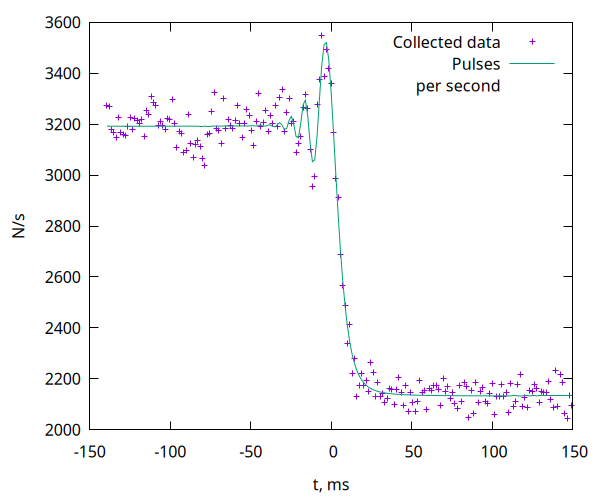

# StarAngularDiameter

## Зависимости
1. gcc (g++)
2. abseil-cpp

Debian/Ubuntu:
```
# apt-get install libabsl-dev
```

ArchLinux:
```
# pacman -S abseil-cpp
```

## Структура проекта

Исходный код находится в папке `src`.

## Сборка проекта
```
$ make
```

## Используемые формулы (все взяты из книги Черепащука А.М.)

$$T(t_i,L_0,P_1,P_2,V,t_0,R_0) = 
P_1 T_1(t_i, V, t_0, R_0) + P_2 T_2(t_i, V, t_0, R_0) + L_0$$

$$T_1(t_i, V, t_0, R_0) = \frac{1}{V}
(G_3(V (t_i + \Delta t - t_0), R_0) - G_3(V (t_i - \delta t - t_0), R_0) )$$

$$T_2(t_i, V, t_0, R_0) = \frac{1}{V}
(G_4(V (t_i + \Delta t - t_0), R_0) - G_4(V (t_i - \delta t - t_0), R_0) )$$

$$G_3(x, R_0) = \int_{-R_0}^{R_0}\frac{\sqrt{R_0^2-\beta^2}}{R_0}G_2(x+\beta) d\beta$$

$$G_4(x, R_0) = \int_{-R_0}^{R_0}\frac{R_0^2-\beta^2}{R_0}G_2(x+\beta) d\beta$$

$$G_2(x) = \int_{-R}^{R}\sigma(y)G_1(x+y) dy$$

$$G_1(x) = \int_{\lambda_1}^{\lambda_2}
\sqrt{\frac{\lambda l}{2}}G_0(x\sqrt{\frac{2}{\lambda l}})E(\lambda) d\lambda$$

$$G_0(x) = \frac{I_0}{8} (2x + 4xC(x) - \frac{4}{\pi}\sin\frac{x^2\pi}{2} + 
4xS(x) + \frac{4}{\pi}\cos\frac{x^2\pi}{2} + 
4xC^2(x) - \frac{8}{\pi}\sin\frac{x^2\pi}{2}C(x) + 4xS^2(x) + 
\frac{8}{\pi}\cos\frac{x^2\pi}{2}S(x) )$$

$$S(\omega) = \int_0^{\omega}\sin\frac{\pi t^2}{2} dt$$

$$C(\omega) = \int_0^{\omega}\cos\frac{\pi t^2}{2} dt$$

Значения интегралов вычисляются методом Симпсона.

## Список констант (Все, кроме $I_0$ и $t_N$ взяты из книги Черепащука А.М.)

- $I_0 = 4.509$ $Вт/м^2$ — интенсивность свечения;
- $R = 0.24$ м — радиус апертуры;
- $\lambda_1 = 6250$ A ($м^{-10}$) — интервал(начало) длин волн;
- $\lambda_2 = 7750$ A ($м^{-10}$) — интервал(конец) длин волн;
- $l = 3.64825 * 10^8$ м — расстояние до Луны;
- $P_1 = 1$, $P2 = 0$ — константы, выражающие распределение потемнения по диску звезды;
- $L_0 = 2$ — фон неба;
- $\Delta t = 2 * 10^{-3}$ с — длительность одного измерения t;
- $V = 726$ м/с — скорость центра диска луны;
- $t_0 = 78.4 * 10^{-3}$ с — время пересечения центра диска луны;
- $t_N = 180 * 10^{-3}$ с — суммарное время наблюдений;
- $R_0 = 2.8$ м — радиус проекции звезды на плоскость видимого диска луны.

## Примеры графиков

График показывает процесс «закрытия» звезды Луной ( $T(t_i, L_0, P_1, P_2, V, t_0, R_0)$ ).


